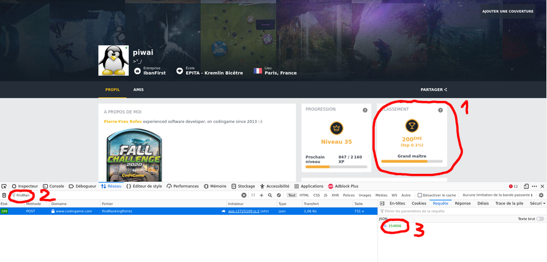

# cg-golf-stats
A tool to get a csv extract of codegolf contests on codingame.com platform


# How to use

First, you'll need to get your codingame user id.

From your profile page, open browser dev tools (hit F12), then 
 1. click on the "ranking" tile
 2. In the dev toolbar, in the "Network" tab, look for the call to "findRankingPoints"
 3. In the "Request" section on the right, you will find your codingamer ID



 Once you have it, just run :

```
./run.sh <codingamer_id>
```

This will produce a codegolf-<codingamer_id>.csv file with your code golf stats per puzzle, which you can then import to Excel/Libreoffice for easier analysis.
